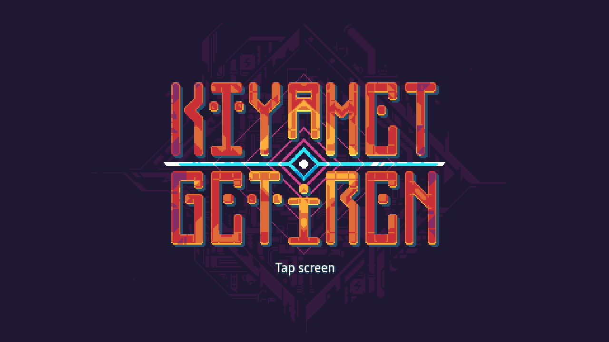
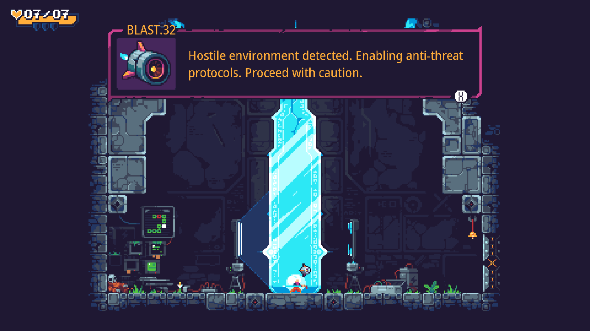
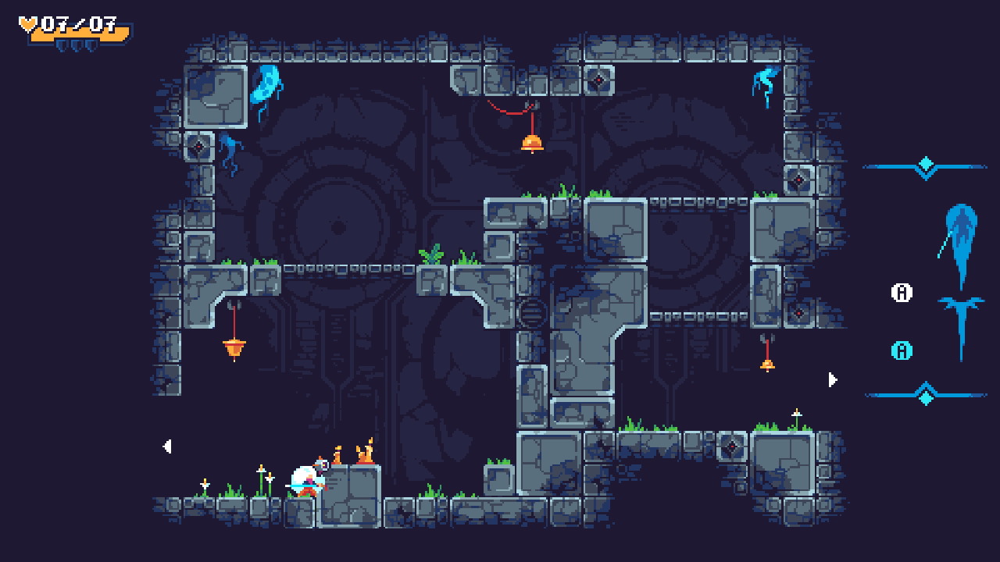
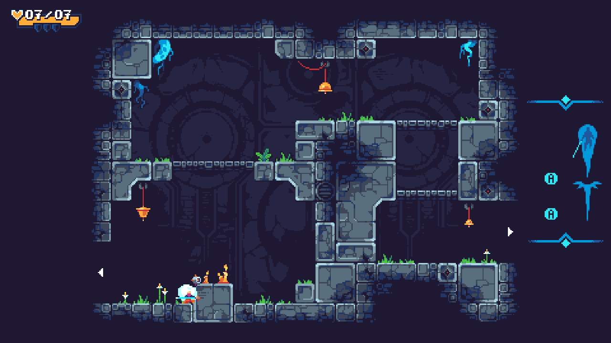

# ScourgeBringer 1.61.x — AArch64 MonoGame/.NET Android port

[](https://github.com/NextOs-Ports/scourgebringer-nextos/actions/workflows/ci.yml)
[](https://github.com/NextOs-Ports/scourgebringer-nextos/releases)
[](LICENSE)

**🌐 Language / Idioma:** [🇬🇧 English](#-english) · [🇧🇷 Português](#-português)

This project is an independent compatibility loader. It does not distribute
ScourgeBringer's APK, art, music, Android libraries or any other proprietary
game data. / Este projeto é um loader de compatibilidade independente e não
distribui o APK nem os dados proprietários do jogo.

**Community test / Teste comunitário:**
[download `v1.0.0-test.8`](https://github.com/NextOs-Ports/scourgebringer-nextos/releases/tag/v1.0.0-test.8).
The Mali-450 baseline and the menu/gameplay correction are physically proven;
old-glibc acceptance on a real glibc 2.30 device remains pending.

## Screenshots / Capturas









## Community

Questions, test feedback and news about other ports / Dúvidas, retorno dos
testes e novidades sobre outros ports:

💬 **Discord:** [discord.gg/DHfY62eDNN](https://discord.gg/DHfY62eDNN)

---

## 🇬🇧 English

Native Linux-handheld port of the Android release of **ScourgeBringer** (Flying
Oak Games / Dear Villagers), driven by the repository's AArch64 so-loader, its
Android/Java compatibility environment and the pinned universal framework 6.8
stack. Status: **PLAYABLE** on the established NextOS Mali-450 baseline. The
exact **1.0.0-test.5** ZIP also passed tree entry, death/return, gameplay and
save checks on a DarkOS RK3326/Mali-G31 system. **1.0.0-test.8** preserves the
late Play Core `ReviewManager`/`Task` fix and test.7's old-glibc bridge, then
fixes the invisible horizontal selection in the root title menu without
filtering controller input.
The ArkOS fault address `0x15250` is `libSystem.Native.so`'s unresolved PLT0:
glibc 2.30 does not dynamically export `arc4random_buf` or `mknod`, and
`System.Random` reaches the former during `MainActivity.n_onCreate`. Both now
have explicit adapter providers, alongside the complete Bionic signal-layout
translation introduced in test.6. Host, emulated AArch64 and low-glibc ELF
gates pass. The exact test.8 ELF passed a physical glibc 2.41 run through
KMSDRM, MainActivity, FMOD/ALSA, controller and READY 9/9. Left/right no longer
lose the visible root-menu selection, vertical navigation still works,
horizontal input remains active in Settings, and full-range movement in both
directions was confirmed during gameplay. Physical acceptance on an actual
glibc 2.30 target is still pending, so no additional device family is claimed.

It follows the proven Mono-Android loader lineage established by Stardew
Valley and TMNT: Shredder's Revenge in the main ports repository. Their tested
patterns remain in this game-specific adapter while reusable host contracts
come from the pinned framework.

### Tested status

| Area | Result |
|---|---|
| Boot, title, intro cinematic | Working |
| Rooms, HUD, dialogue, combat | Playable; movement and attacks verified on screen |
| Text language | 12 selectable languages, including Brazilian Portuguese (`PB`) |
| Audio | FMOD Studio through the port's AAudio bridge; measured signal during play |
| Controller | Native Android gamepad events; menu and full-range gameplay movement physically revalidated in test.8 |
| Display aspect | Automatic: 4:3 stretches the complete 16:9 frame to fill the panel without bars; 16:9 stays native |
| Settings/save | `data/.config/.isolated-storage/`, outside the extracted runtime seal |
| Memory | ~117 MiB RSS, **no swap**, ~455 MiB still available |
| Frame pace | 40 fps flat, zero late frames (the game's own `FramerateMode=Vsync`) |
| Exit | The game's native Quit action returns to Ports; `SELECT + START` remains an emergency shortcut |
| Online services | Intentionally unavailable; the port is offline/local |

Historical ArkOS testing reported KMSDRM at 640×480, a matching
640×480 GL drawable classified as 4:3, Mali-G31 OpenGL ES 3.2, 48 kHz stereo
ALSA, one mapped controller and READY with 9/9 required capabilities. The
display path follows the proven Katana ZERO Netflix rule: desktop mode chooses
the window and the live drawable is the final authority, so a 16:9 panel is
selected automatically without a firmware list. On a narrower panel, the
port-specific final pass expands the complete 16:9 composition to the drawable.
The DarkOS `test.4` run reproduced the tree-transition exception. The exact
`test.5` ZIP then passed that transition plus death/return and save checks. An
ArkOS4Clone run progressed beyond the old glibc imports and through Mono's
marshal-ilgen component load before exposing the separate signal-mask ABI
failure addressed by test.6, then exposed the unresolved PLT import addressed
by test.7. Test.8 additionally passed the title-menu regression and full-range
gameplay movement on glibc 2.41; the old-glibc fix still needs physical
acceptance on glibc 2.30.

Brazilian Portuguese was also checked physically: `pt-br` reached the runtime
as `pt-BR`/`PB`, the captured title frame showed Portuguese text and the
resulting `Language=PB` setting retained the same hash across a later launch.
The migrated legacy setting likewise retained the same hash before and after
the classic and b19 tests.

### How it works (architecture)

The Android build is a .NET-for-Android/MonoVM application on MonoGame
3.8.1.303. There is no Android system, Java VM, Activity manager or GLES3 driver
on the target, so the loader recreates only the contracts the game actually
uses:

1. `nxbootstrap` 0.6.8 owns PortMaster setup, single-instance locking,
   NXExtract, required-file gates, logging and terminal handoff.
2. `so_util` maps and relocates the Android AArch64 ELF libraries, also
   following each module's `DT_NEEDED` list so dependencies are mapped first.
3. The loader starts Mono/Xamarin and exposes a fake `JavaVM`/`JNIEnv`, calling
   `JNI_OnLoad` on every module it maps, the way `System.loadLibrary` would.
4. JNI shims register `ScourgeBringer.Program` and `MonoGameAndroidGameView`,
   then replay the minimum Activity lifecycle the managed game needs.
5. SDL owns the platform window/context; the EGL bridge shares those objects
   with MonoGame and `nxgl` publishes the exact runtime receipt.
6. Bionic imports are translated to glibc, including a full Bionic-layout
   `pthread_attr_t` (56 bytes against glibc's 64), the complete arm64
   `sigset_t` bridge (8 bytes against glibc's 128), explicit old-glibc
   filesystem aliases and the Bionic `_ctype_` data symbol.
7. SDL controller state is emitted as genuine Android `KeyEvent` and
   `MotionEvent` objects; `nxinput` observes mappings without draining events.
   If the root menu selects its retained but undrawn Discord entry, the adapter
   restores the previous visible entry after the game's own update; it never
   edits buttons or axes.
8. A virtual `libaaudio.so` backed by SDL2 gives FMOD its normal Android output
   path; `nxaudio` reports only the real opened stream. `nxandroid` records the
   delegated native phases without replacing their order.
9. `aspect_fill` is enabled only for panels narrower than 16:9. It copies the
   complete composed frame and scales it to the physical drawable; exact 16:9
   output bypasses the pass.
10. The launcher exposes a validated language selection and the adapter maps
    it to Android locale, .NET runtime locale and the game's localization code.

### Main problems solved

| Problem | Root cause | Fix |
|---|---|---|
| Runtime never found the assemblies | This build keeps the store inside the APK, not in `libs`, and its `Runtime_init` takes 11 arguments with `apiLevel` in the third stack slot | Pass a reduced, `STORED` and aligned APK through `runtimeApks` |
| Black screen then return to Ports on glibc 2.30 | On AArch64 glibc before 2.33, `stat` is linkable through `libc_nonshared.a` but is not a dynamic libc export; the loader's `dlsym("stat")` fallback left the guest PLT slot unresolved and `libmonodroid` jumped through it during `Runtime_init` | Bind `stat`/`stat64`/`lstat`/`fstat64` through layout-verified adapter wrappers and provide the guest's `strlcpy` and `_ctype_` imports explicitly |
| SIGSEGV at raw `0x15250` during `MainActivity.n_onCreate` on ArkOS/glibc 2.30 | `0x15250` is `libSystem.Native.so` PLT0; its `arc4random_buf`/`mknod` imports were unresolved, and `System.Random` jumped through the first one | Bind both explicitly; provide random bytes through `getrandom(2)` with `/dev/urandom` fallback, following the approved Stardew Valley Mono-Android port |
| Signal corruption during Mono startup on ArkOS/glibc 2.30 | Mono allocates 8-byte arm64 Bionic `sigset_t` objects, but unwrapped glibc signal-set APIs read or write 128 bytes | Bind every imported signal-set API to an explicit 8↔128-byte translator; validate with guarded canaries and keep fatal reporting async-safe |
| Crash on the first FMOD call | `libfmodstudio.so` was mapped with every `libfmod.so` symbol unresolved | Read `DT_NEEDED` and map dependencies first, accumulating their symbols |
| FMOD refused to initialize | `libfmod.so` never got its `JNI_OnLoad`, so it had no `JavaVM` | Call `JNI_OnLoad` on every dynamically mapped module |
| SIGSEGV with a zeroed callee-saved register | glibc's `pthread_attr_init` writes 64 bytes into the caller's 56-byte Bionic slot and erased a saved register on the stack | Implement the Bionic layout and translate to a real attr only inside `pthread_create` |
| `System::init` returned ERR_INTERNAL | Bionic accepts stacks below glibc's `PTHREAD_STACK_MIN`; returning `EINVAL` is fatal for FMOD | Accept the requested size and raise it to the minimum at thread creation |
| No audio output at all | FMOD opens audio through `libaaudio.so` / `libOpenSLES.so`, neither of which exists here | Virtual `libaaudio.so` implemented over SDL2 |
| Process died inside `ld-linux` on teardown | FMOD calls `dlclose` on the virtual `libaaudio.so` handle and glibc treats the argument as a `link_map` | Route `dlclose` through the shim table |
| Sound banks not found | Paths arrive as `file:///android_asset/...` | Resolve them against the asset directory |
| Black screen with the game rendering | The TMNT texture policy (downscale, RGBA4444, ETC1, ASTC) was inherited by default | Off by default: every texture here is `SurfaceFormat.Color` and the game is pixel art |
| Black bars on 4:3 panels | The managed game always composes a 16:9 frame even after receiving the correct 4:3 drawable | Capability-based final stretch from the centered 16:9 frame to the full drawable; inactive on 16:9 |
| Controller detected but ignored | The `Program` ACW declares exactly seven native methods; two extra entries made the whole registration fail, leaving `n_onActivityResult` unbound | Use the method list from the dex |
| Left/right removed the root-menu highlight | The Android logic still selects a Discord entry that this build never draws | Restore only the title manager's hidden selection to the last visible entry; preserve every controller button and axis for Settings and gameplay |
| Title stuck on "Press any button" | The game only starts once the Play Games helper reaches `NotConnected`, and the silent sign-in Task can never complete here | Deliver `onActivityResult(0x2329, RESULT_CANCELED)`, the game's own offline branch, on the game thread from the third account query on |
| Black screen when entering the tree | `GameStates.ToNextLevel()` makes a fire-and-forget in-app review request; without Play Core, `ReviewManagerFactory.Create()` returned `null`, and the game dereferenced it before completing the transition | Expose only the exact offline Play Core `ReviewManager` and non-null `Task` peers; no review UI is shown and the native game transition remains authoritative |
| `L2` / `R2` did nothing in game | MonoGame's `AndroidGamePad` reads the triggers from `AXIS_LTRIGGER` (17) and `AXIS_RTRIGGER` (18) only; the bridge published them on `AXIS_BRAKE` (23) / `AXIS_GAS` (22), so `GamePadState.Triggers` stayed at 0 | Publish the trigger value on all four axes |
| Every launch extracted again and reset progress | The runtime received `libs` as `filesDir`, so IsolatedStorage modified the NXExtract-sealed library tree and invalidated its marker | Reproduce Android's real `appDirs` order and keep writable state under `data`; legacy files are copied once without deleting their source |
| Native Quit left a black screen | `Activity.finish()` destroyed the game surface, but the outer Linux input loop did not observe the request | Convert `finish` into the normal `onPause` → `onStop` → `onDestroy` lifecycle and let the supervised launcher return to Ports |
| APK b19 failed recipe validation | b19 stores managed assemblies in `libassemblies.arm64-v8a.blob.so` instead of `assemblies/` | Validate both proven layouts and build a reduced aligned runtime APK for either one |

### Controls

The game receives the normal Xbox/Android layout, so its own button prompts and
bindings remain authoritative.

| Controller | Action |
|---|---|
| Left stick / D-pad | Move and menu navigation |
| `A` | Confirm / jump |
| `B` | Cancel / dash |
| `X`, `Y` | Attack and secondary actions |
| `L1`, `R1` | Native shoulder actions |
| `START` | Pause |
| `SELECT` | Android Back |
| Native Quit / `B` where offered by the game | Exit normally and return to EmulationStation |
| `SELECT + START` | Emergency exit shortcut |

Remapping is available in the game's own options screen.

### Save data

```text
data/.config/.isolated-storage/       # settings.ini, gamepad.map, 0.sav
```

The .NET IsolatedStorage root now follows Android's real `filesDir` entry in
`appDirs`, not the immutable native-library directory. On the first updated
launch, known files from the former `libs/.config/.isolated-storage/` location
are copied only when no destination exists; the legacy source is retained.

### Getting the game data — required

The repository contains the loader, not the copyrighted game. Put a legally
obtained AArch64 APK for package `com.pid.scourgebringer` in `gamedata/`.
Validated inputs are the 1.61.16 classic assembly-store APK and the 1.61 b19
blob-DSO APK. The recipe deliberately uses a flexible, bounded content-tree
range, so b17, b18 and other 1.61.x variants are not rejected merely for small
count or size differences. They are accepted only when their internal package,
ABI, core content, all 12 localization files and essential libraries still
match the safe contract. NXExtract 1.2.6 transactionally creates:

```text
assets/Content/                 # .xnb content and FMOD banks
runtime-libs/*.so               # sealed AArch64 Mono/Xamarin/FMOD/OpenAL libraries
assemblies.apk                  # reduced/aligned classic store or b19 blob container
```

`libaot-*.so` are deliberately not used: the loader refuses them and lets Mono
JIT, because those images carry PLT/IRELATIVE relocations the loader does not
handle.

Final device layout:

```text
<rom-root>/ports/
├── ScourgeBringer.sh
└── scourgebringer/
    ├── scourgebringer-nextos
    ├── nxport.json
    ├── extractor.json
    ├── port-env.sh
    ├── nxextract/
    ├── gamedata/<owned-game>.apk
    ├── assemblies.apk            # created by NXExtract
    ├── assets/Content/            # created by NXExtract
    ├── runtime-libs/              # created and sealed by NXExtract
    └── data/.config/.isolated-storage/
```

### Build and run

```bash
git clone https://github.com/NextOs-Ports/scourgebringer-nextos.git
cd scourgebringer-nextos
bash build.sh
```

`build.sh` extracts the immutable framework commit from `FRAMEWORK-PIN.json`.
Inside the main ports monorepo it reuses the local Git object; a standalone
clone fetches only that exact commit from the canonical repository and verifies
its object ID. It checks every pinned component version, then runs in the
pinned offline Debian Buster container. It uses the NextOS sysroot for headers
only and produces
`./scourgebringer-nextos`. The checked
artifact requires at most `GLIBC_2.17`, below the public `GLIBC_2.30` ceiling.
Copy the development tree directly to the layout above and launch through the
generated PortMaster script. It displays NXExtract when needed, runs the game in
the foreground and hands control back to EmulationStation on exit. Community
test 1.0.0-test.8 is distributed as a BYO-data ZIP: it contains no APK, game
assets, saves or extracted Android libraries.

### Language and compatible data

The game ships `EN`, `FR`, `IT`, `DE`, `SP`, `RU`, `PB`, `CN`, `JP`, `KR`,
`PL` and `CHT`. Choose a language in the game's own options; it is persisted in
`settings.ini`. The generated launcher also has a visible
`GAME_LANGUAGE="auto"` line for the initial locale. A filename never determines
compatibility: the diagnostic `payload tree monogame-content failed count/size
validation` means the package was recognized but its internal data is outside
the validated 1.61.x contract.

### Licenses and ownership

The loader is distributed under this repository's GPL-3.0 license. Portions of
the reusable loader framework derive from `mtojek/syberia_arm64` and
`mtojek/lswtcs_arm64` under Apache-2.0; see the repository `NOTICE`.

The game, characters, art, music and data remain property of their respective
owners, including Flying Oak Games and Dear Villagers. They are not licensed by
this loader project.

---

## 🇧🇷 Português

Port nativo para Linux handheld da versão Android de **ScourgeBringer** (Flying
Oak Games / Dear Villagers), dirigido pelo so-loader AArch64 do repositório,
pelo ambiente de compatibilidade Android/Java e pela pilha universal fixada do
framework 6.8. Estado: **JOGÁVEL** no baseline NextOS Mali-450 já aprovado. O
ZIP exato **1.0.0-test.5** também passou entrada na árvore, morte/retorno,
gameplay e save num RK3326/Mali-G31 com DarkOS. A **1.0.0-test.8** preserva essa
correção tardia de `ReviewManager`/`Task` e o bridge de glibc antiga da test.7,
além de corrigir a seleção horizontal invisível do menu inicial sem filtrar a
entrada do controle. O endereço `0x15250` era o PLT0 bruto de
`libSystem.Native.so`: `arc4random_buf` e `mknod` ficaram sem resolução, e
`System.Random` chamou o primeiro durante `MainActivity.n_onCreate`. Ambos têm
agora providers explícitos. Os gates host, AArch64 emulado e ELF de baixa glibc
passaram. O ELF exato da test.8 passou fisicamente em glibc 2.41 por KMSDRM,
MainActivity, FMOD/ALSA, controle e READY 9/9. Esquerda/direita mantiveram uma
opção visível no menu raiz, a navegação vertical continuou funcionando, o eixo
horizontal permaneceu ativo em Configurações e o movimento completo nas duas
direções foi confirmado durante o gameplay. A correção de glibc antiga ainda
precisa de aceitação física em 2.30.

Ele segue a linhagem comprovada dos loaders Mono-Android de Stardew Valley e
TMNT: Shredder's Revenge no repositório principal de ports. Os padrões testados
continuam no adapter específico do jogo, enquanto os contratos reutilizáveis
do host vêm do framework fixado.

### Estado testado

| Área | Resultado |
|---|---|
| Boot, título, cena de introdução | Funcionando |
| Salas, HUD, diálogo, combate | Jogável; movimento e ataque conferidos na tela |
| Idioma do texto | 12 idiomas selecionáveis, incluindo português do Brasil (`PB`) |
| Áudio | FMOD Studio pela ponte AAudio do port; sinal medido durante o jogo |
| Controle | Eventos Android nativos; menu e movimento de gameplay em escala completa revalidados fisicamente na test.8 |
| Aspecto da tela | Automático: em 4:3 o quadro 16:9 completo preenche o painel sem barras; em 16:9 permanece nativo |
| Configuração/save | `data/.config/.isolated-storage/`, fora do selo dos arquivos extraídos |
| Memória | ~117 MiB de RSS, **sem swap**, ~455 MiB ainda livres |
| Ritmo de quadros | 40 fps cravados, zero quadros atrasados (`FramerateMode=Vsync` do próprio jogo) |
| Saída | A opção nativa de sair volta para Ports; `SELECT + START` permanece como atalho de emergência |
| Serviços online | Indisponíveis de propósito; o port é offline/local |

Em testes históricos no ArkOS foram reportados KMSDRM em 640×480,
drawable GL também em 640×480 classificado como 4:3, Mali-G31 com OpenGL ES
3.2, ALSA estéreo a 48 kHz, um controle mapeado e READY com 9/9 capacidades
obrigatórias. O vídeo segue a regra comprovada no Katana ZERO Netflix: o modo
do desktop escolhe a janela e o drawable real é a autoridade final; assim, um
painel 16:9 é selecionado automaticamente sem lista de firmware. Em painel mais
estreito, o passe final específico do port expande a composição 16:9 completa
até o drawable. A execução `test.4` no DarkOS reproduziu a exceção da árvore; o
ZIP exato `test.5` passou depois essa transição, morte/retorno e save. Uma
execução no ArkOS4Clone avançou além dos imports antigos da glibc e carregou o
componente marshal-ilgen do Mono antes de expor a falha separada da ABI de
máscaras de sinal e então expôs o PLT não resolvido tratado pela test.7. A
regressão da test.7 passou em glibc 2.41. A test.8 também passou a regressão do
menu inicial e movimento completo no gameplay; a correção de glibc antiga ainda
exige aceitação física em 2.30.

O português brasileiro também foi conferido fisicamente: `pt-br` chegou ao
runtime como `pt-BR`/`PB`, a captura do título mostrou texto em português e o
`Language=PB` gerado manteve o mesmo hash numa abertura posterior. A
configuração legada migrada também manteve o mesmo hash antes e depois dos
testes clássico e b19.

### Como funciona (arquitetura)

O jogo Android é um aplicativo .NET-for-Android/MonoVM sobre MonoGame
3.8.1.303. O alvo não tem Android, JVM, Activity Manager nem driver GLES3, então
o loader recria só os contratos que o jogo realmente usa:

1. O `nxbootstrap` 0.6.8 cuida de PortMaster, lock de instância, NXExtract,
   arquivos obrigatórios, log e devolução do terminal.
2. O `so_util` mapeia e reloca as bibliotecas ELF Android AArch64, também
   seguindo o `DT_NEEDED` de cada módulo para mapear as dependências antes.
3. O loader inicia Mono/Xamarin e expõe `JavaVM`/`JNIEnv` falsos, chamando o
   `JNI_OnLoad` de cada módulo mapeado, como faria o `System.loadLibrary`.
4. Os shims JNI registram `ScourgeBringer.Program` e `MonoGameAndroidGameView` e
   reproduzem o ciclo de vida mínimo da Activity.
5. O SDL é dono da janela/contexto; a ponte EGL compartilha esses objetos com o
   MonoGame e o `nxgl` publica o comprovante exato do runtime.
6. Imports Bionic são traduzidos para glibc, incluindo o `pthread_attr_t` com
   layout Bionic completo (56 bytes contra os 64 da glibc), a ponte completa
   de `sigset_t` arm64 (8 bytes contra os 128 da glibc), aliases explícitos de
   filesystem para glibc antiga e o símbolo de dados Bionic `_ctype_`.
7. O estado dos controles vira `KeyEvent` e `MotionEvent` Android reais; o
   `nxinput` observa mappings sem consumir eventos. Se o menu raiz selecionar a
   entrada Discord preservada na lógica, mas não desenhada, o adapter restaura
   a última entrada visível depois do update nativo; nenhum botão ou eixo é
   alterado.
8. Um `libaaudio.so` virtual sobre SDL2 dá ao FMOD seu caminho Android normal; o
   `nxaudio` só reporta o stream real aberto. O `nxandroid` registra as fases
   nativas delegadas sem substituir sua ordem.
9. O launcher expõe uma seleção validada de idioma, traduzida pelo adapter para
   o locale Android, o locale do .NET e o código de localização do jogo.

### Principais problemas resolvidos

| Problema | Causa real | Correção |
|---|---|---|
| O runtime não achava os assemblies | Esta build guarda o store dentro do APK, não em `libs`, e o `Runtime_init` dela tem 11 argumentos, com `apiLevel` no terceiro slot de pilha | Passar um APK reduzido, STORED e alinhado, por `runtimeApks` |
| Tela preta e retorno a Ports na glibc 2.30 | Em AArch64 antes da glibc 2.33, `stat` é linkável por `libc_nonshared.a`, mas não é exportado dinamicamente pela libc; o fallback `dlsym("stat")` deixou o slot PLT do guest sem destino e o `libmonodroid` saltou por ele durante `Runtime_init` | Ligar `stat`/`stat64`/`lstat`/`fstat64` a wrappers do adapter com layout conferido e fornecer explicitamente `strlcpy` e `_ctype_` exigidos pelo guest |
| SIGSEGV em `0x15250` durante `MainActivity.n_onCreate` no ArkOS/glibc 2.30 | `0x15250` é o PLT0 de `libSystem.Native.so`; `arc4random_buf`/`mknod` ficaram sem resolução e `System.Random` chamou o primeiro | Ligar ambos explicitamente; gerar bytes por `getrandom(2)` com fallback `/dev/urandom`, seguindo o port aprovado de Stardew Valley |
| Corrupção de sinais durante o boot do Mono no ArkOS/glibc 2.30 | O Mono aloca `sigset_t` Bionic arm64 de 8 bytes, mas APIs glibc sem wrapper usam 128 bytes | Ligar toda API de máscara a um tradutor 8↔128 bytes e manter o relatório fatal async-safe |
| Crash na primeira chamada do FMOD | `libfmodstudio.so` entrava com todos os símbolos do `libfmod.so` não resolvidos | Ler `DT_NEEDED` e mapear as dependências antes, acumulando os símbolos |
| FMOD recusava inicializar | O `libfmod.so` nunca recebia seu `JNI_OnLoad` e ficava sem `JavaVM` | Chamar `JNI_OnLoad` em todo módulo carregado dinamicamente |
| SIGSEGV com registrador salvo zerado | O `pthread_attr_init` da glibc escreve 64 bytes no espaço de 56 do chamador e apagava um registrador salvo na pilha | Implementar o layout Bionic e traduzir para um attr real só dentro do `pthread_create` |
| `System::init` devolvia ERR_INTERNAL | O bionic aceita pilhas menores que o `PTHREAD_STACK_MIN` da glibc; devolver `EINVAL` é fatal para o FMOD | Aceitar o valor pedido e elevar ao mínimo na criação da thread |
| Nenhum áudio | O FMOD abre a saída por `libaaudio.so` / `libOpenSLES.so`, e nenhuma existe aqui | `libaaudio.so` virtual implementada sobre o SDL2 |
| Processo morria dentro do `ld-linux` no teardown | O FMOD faz `dlclose` no handle virtual de `libaaudio.so` e a glibc trata o argumento como `link_map` | Levar o `dlclose` para a tabela de shims |
| Banks de som não encontrados | Os caminhos chegam como `file:///android_asset/...` | Resolver contra o diretório de assets |
| Tela preta com o jogo desenhando | A política de textura do TMNT (redução, RGBA4444, ETC1, ASTC) veio ligada por herança | Desligada por padrão: aqui toda textura é `SurfaceFormat.Color` e o jogo é pixel art |
| Controle detectado mas ignorado | O ACW do `Program` declara exatamente sete métodos nativos; dois a mais derrubavam o registro inteiro e deixavam `n_onActivityResult` sem handler | Usar a lista de métodos do dex |
| Esquerda/direita apagavam o destaque do menu raiz | A lógica Android ainda seleciona uma entrada Discord que esta build nunca desenha | Restaurar somente a seleção invisível do gerenciador de título para a última entrada visível; preservar todos os botões e eixos em Configurações e no gameplay |
| Título preso em "Press any button" | O jogo só começa quando o helper de Play Games chega a `NotConnected`, e a Task de silent sign-in não tem como completar aqui | Entregar `onActivityResult(0x2329, RESULT_CANCELED)`, o caminho offline do próprio jogo, na thread do game loop, a partir da terceira consulta de conta |
| Tela preta ao entrar na árvore | `GameStates.ToNextLevel()` dispara uma avaliação in-app sem esperar retorno; sem Play Core, `ReviewManagerFactory.Create()` devolvia `null` e o jogo o desreferenciava antes de concluir a transição | Expor somente os peers offline exatos `ReviewManager` e `Task`; nenhuma tela de avaliação é aberta e a transição nativa do jogo continua sendo a autoridade |
| `L2` / `R2` não faziam nada no jogo | O `AndroidGamePad` do MonoGame lê os gatilhos só de `AXIS_LTRIGGER` (17) e `AXIS_RTRIGGER` (18); a ponte publicava em `AXIS_BRAKE` (23) / `AXIS_GAS` (22) e `GamePadState.Triggers` ficava sempre 0 | Publicar o valor do gatilho nos quatro eixos |
| Toda abertura extraía de novo e apagava o progresso | O runtime recebia `libs` como `filesDir`; o IsolatedStorage alterava a árvore selada pelo NXExtract e invalidava o marker | Reproduzir a ordem real de `appDirs`, guardar escrita em `data` e copiar o legado uma única vez, sem apagar a origem |
| Sair pelo jogo deixava tela preta | `Activity.finish()` destruía a surface, mas o loop Linux externo continuava ativo | Observar `finish`, executar `onPause` → `onStop` → `onDestroy` e deixar o launcher supervisionado retornar a Ports |
| O APK b19 falhava na validação | O b19 guarda assemblies em `libassemblies.arm64-v8a.blob.so`, não em `assemblies/` | Validar os dois layouts comprovados e gerar o container reduzido/alinhado correto para cada um |

### Controles

O jogo recebe o layout Xbox/Android normal, então os prompts e bindings internos
dele são a referência final.

| Controle | Ação |
|---|---|
| Analógico esquerdo / D-pad | Movimento e navegação |
| `A` | Confirmar / pular |
| `B` | Cancelar / dash |
| `X`, `Y` | Ataque e ações secundárias |
| `L1`, `R1` | Ombros nativos |
| `L2`, `R2` | Gatilhos nativos (validados no aparelho em 23/jul) |
| `START` | Pausa |
| `SELECT` | Back do Android |
| Sair nativo / `B` onde o jogo oferecer | Encerrar normalmente e voltar ao EmulationStation |
| `SELECT + START` | Atalho de saída de emergência |

O remapeamento fica disponível na tela de opções do próprio jogo.

### Save

```text
data/.config/.isolated-storage/       # settings.ini, gamepad.map, 0.sav
```

A raiz do IsolatedStorage do .NET agora segue o `filesDir` real de `appDirs`, e
não o diretório imutável de bibliotecas. Na primeira abertura atualizada, os
arquivos conhecidos de `libs/.config/.isolated-storage/` são copiados somente
quando ainda não existe destino; a origem antiga é mantida.

### Como obter os dados — obrigatório

O repositório contém o loader, não o jogo protegido por direitos autorais.
Coloque em `gamedata/` um APK AArch64 obtido legalmente do pacote
`com.pid.scourgebringer`. Foram validados o APK 1.61.16 com assembly store
clássico e o APK 1.61 b19 com blob DSO. A receita usa uma faixa flexível e
limitada da árvore de conteúdo, portanto b17, b18 e outras variantes 1.61.x não
são rejeitadas apenas por pequenas diferenças de quantidade ou tamanho. Elas
só são aceitas se pacote, ABI, conteúdo central, os 12 arquivos de idioma e as
bibliotecas essenciais cumprirem o contrato seguro. O NXExtract 1.2.6 cria de
forma transacional:

```text
assets/Content/                 # conteúdo .xnb e banks do FMOD
runtime-libs/*.so               # bibliotecas AArch64 seladas pelo NXExtract
assemblies.apk                  # store clássico ou blob b19 reduzido/alinhado
```

As `libaot-*.so` não são usadas de propósito: o loader as recusa e deixa o Mono
fazer JIT, porque essas imagens trazem relocações PLT/IRELATIVE que ele não
trata.

Layout final no aparelho:

```text
<raiz-rom>/ports/
├── ScourgeBringer.sh
└── scourgebringer/
    ├── scourgebringer-nextos
    ├── nxport.json
    ├── extractor.json
    ├── port-env.sh
    ├── nxextract/
    ├── gamedata/<jogo-legal>.apk
    ├── assemblies.apk            # criado pelo NXExtract
    ├── assets/Content/            # criado pelo NXExtract
    ├── runtime-libs/              # criado e selado pelo NXExtract
    └── data/.config/.isolated-storage/
```

### Compilar e rodar

```bash
git clone https://github.com/NextOs-Ports/scourgebringer-nextos.git
cd scourgebringer-nextos
bash build.sh
```

O `build.sh` extrai o commit imutável declarado no `FRAMEWORK-PIN.json`. Dentro
do monorepo principal ele reutiliza o objeto Git local; num clone standalone,
baixa somente esse commit exato do repositório canônico e confere seu ID. Depois
valida a versão de cada componente fixado e roda no container Debian Buster
offline. Ele usa o sysroot NextOS somente para headers e gera
`./scourgebringer-nextos`. O artefato conferido exige
no máximo `GLIBC_2.17`, abaixo do teto público `GLIBC_2.30`. Copie a árvore de
desenvolvimento diretamente para o layout acima e abra pelo launcher PortMaster
gerado. Ele mostra o NXExtract quando necessário, executa em foreground e
devolve o EmulationStation ao sair. O teste comunitário 1.0.0-test.8 é um ZIP
BYO-data: ele não contém APK, assets do jogo, saves nem bibliotecas Android já
extraídas.

### Idiomas e dados compatíveis

O jogo traz `EN`, `FR`, `IT`, `DE`, `SP`, `RU`, `PB`, `CN`, `JP`, `KR`, `PL`
e `CHT`. A troca pode ser feita nas opções do próprio jogo e fica persistida em
`settings.ini`. O launcher gerado também expõe `GAME_LANGUAGE="auto"` para o
locale inicial. O nome do APK nunca determina compatibilidade: o diagnóstico
`payload tree monogame-content failed count/size validation` indica que o
pacote foi reconhecido, mas seus dados internos estão fora do contrato 1.61.x
validado.

### Licenças e propriedade

O loader é distribuído sob a GPL-3.0 deste repositório. Partes do framework
reutilizável derivam de `mtojek/syberia_arm64` e `mtojek/lswtcs_arm64` sob
Apache-2.0; consulte o `NOTICE` do repositório.

O jogo, personagens, arte, música e dados continuam propriedade de seus
respectivos donos, incluindo Flying Oak Games e Dear Villagers. Eles não são
licenciados por este projeto de loader.
